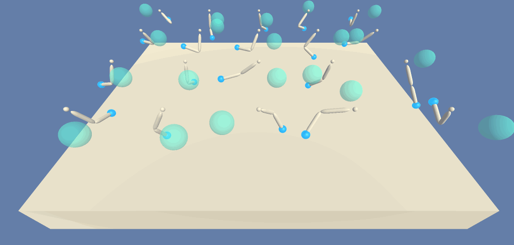
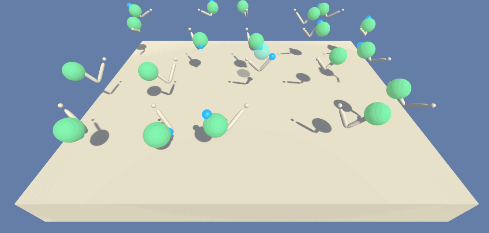

Unity ML-Agents Reacher Environment
========================================

This project aims to solve the Unity Reacher Environment (see `Environment Details`) using Deep Reinforcement Learning (specifically, using DDPG - Deep Deterministic Policy Gradient). 

## Environment Details

In this environment, a double-jointed arm can move to target locations. A reward of +0.1 is provided for each step that the agent's hand is in the goal location. Thus, the goal of the agent is to maintain its position at the target location for as many time steps as possible.

The observation space consists of 33 variables corresponding to position, rotation, velocity, and angular velocities of the arm. Each action is a vector with four numbers, corresponding to torque applicable to two joints. Every entry in the action vector should be a number between -1 and 1.

- Set-up: Double-jointed arm which can move to target locations.
- Goal: The agents must move its hand to the goal location, and keep it there.
- Agents: The environment contains 20 agents linked to a single Brain.
- Agent Reward Function (independent):
	- +0.1 Each step agent's hand is in goal location.
- Brains: One Brain with the following observation/action space.
	- Vector Observation space: 33 variables corresponding to position, rotation, velocity, and angular velocities of the two arm Rigidbodies.
	- Vector Action space: (Continuous) Size of 4, corresponding to torque applicable to two joints.
	- Visual Observations: None.
- Reset Parameters: Two, corresponding to goal size, and goal movement speed.
- Benchmark Mean Reward: 30

The environment is considered to be solved if the agents get an average score of +30 (over 100 consecutive episodes, and ove all agents). 

## Requirements

- Python 3.5 or higher ([Anaconda](https://www.anaconda.com/download/#macos))
- [NumPy](http://www.numpy.org/)
- [PyTorch](https://pytorch.org/) 
- [UnityAgents](https://github.com/Unity-Technologies/ml-agents)
- [OpenAI Gym](https://gym.openai.com/)
- The Reacher Environment: 
	- [Linux](environment/Reacher_Linux.zip)
	- [Mac OSX](environment/Reacher.app.zip)
	- [Windows 32-bit](environment/Reacher_Windows_x86.zip)
	- [Windows 64-bit](environment/Reacher_Windows_x86_64.zip)

	Alternatively, in the `environment` folder download and unzip the appropriate file for Linux/Mac OSX/Windows 32-bit/Windows 64-bit.

## Run

Run the following command on the terminal; doing so will pop up a window on your default browser which you can then use to explore the `Solution.ipynb` file to learn how to train the agent and run the code.

```shell
$ jupyter notebook
```

## Untrained Agent


## Trained Agent



## References
- [Timothy P. Lillicrap, Jonathan J. Hunt, Alexander Pritzel, Nicolas Heess, Tom Erez, Yuval Tassa, David Silver & Daan Wierstra, CONTINUOUS CONTROL WITH DEEP REINFORCEMENT LEARNING. ICLR, 2016.](https://arxiv.org/pdf/1509.02971.pdf)
- [Yan Duan, Xi Chen, Rein Houthooft, John Schulman, Pieter Abbeel, Benchmarking Deep Reinforcement Learning for Continuous Control. ICML, 2016](https://arxiv.org/abs/1604.06778)
- Richard S. Sutton and Andrew G. Barto. Reinforcement Learning: An Introduction.

## License

MIT License

Copyright (c) 2018 Uirá Caiado

Permission is hereby granted, free of charge, to any person obtaining a copy
of this software and associated documentation files (the "Software"), to deal
in the Software without restriction, including without limitation the rights
to use, copy, modify, merge, publish, distribute, sublicense, and/or sell
copies of the Software, and to permit persons to whom the Software is
furnished to do so, subject to the following conditions:

The above copyright notice and this permission notice shall be included in all
copies or substantial portions of the Software.

THE SOFTWARE IS PROVIDED "AS IS", WITHOUT WARRANTY OF ANY KIND, EXPRESS OR
IMPLIED, INCLUDING BUT NOT LIMITED TO THE WARRANTIES OF MERCHANTABILITY,
FITNESS FOR A PARTICULAR PURPOSE AND NONINFRINGEMENT. IN NO EVENT SHALL THE
AUTHORS OR COPYRIGHT HOLDERS BE LIABLE FOR ANY CLAIM, DAMAGES OR OTHER
LIABILITY, WHETHER IN AN ACTION OF CONTRACT, TORT OR OTHERWISE, ARISING FROM,
OUT OF OR IN CONNECTION WITH THE SOFTWARE OR THE USE OR OTHER DEALINGS IN THE
SOFTWARE.

