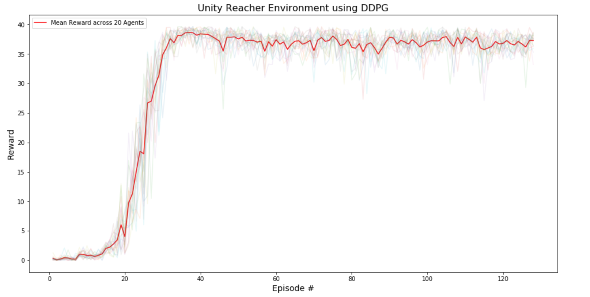

# Project Report

## The Learning Algorithm

The DDPG algorithm is an off-policy, model-free policy gradient model inspired from the seminal paper entitled - *CONTINUOUS CONTROL WITH DEEP REINFORCEMENT LEARNING* (Timothy P. Lillicrap, Jonathan J. Hunt, Alexander Pritzel, Nicolas Heess, Tom Erez, Yuval Tassa, David Silver & Daan Wierstra, ICML, 2016.). Two neural networks - one for the actor, and the other for the crtic - are trained to solve the Unity Reacher Environment (see `Model Architecture` for more details). The actor and critic neural networks takes in 33-dimensional input (state size) from the Unity Reacher Environment. The actor network outputs 4 continuous (action) values between -1 and 1 corresponding to the torque applicable to the two joints (for each agent). Whereas the critic network outputs 1 value corresponding to the Q value for the input state and the action taken. 


### Model Architecture
- Actor

Actor(
  (fc1): Linear(in_features=33, out_features=400, bias=True)
  (fc2): Linear(in_features=400, out_features=300, bias=True)
  (fc3): Linear(in_features=300, out_features=4, bias=True)
)


- Critic

Critic(
  (fcs1): Linear(in_features=33, out_features=400, bias=True)
  (fc2): Linear(in_features=404, out_features=300, bias=True)
  (fc3): Linear(in_features=300, out_features=1, bias=True)
)

### Hyperparameters
The following are the choice of the hyperparameters:
- Replay Buffer Size (BUFFER_SIZE): 100000
- Batch Size (BATCH_SIZE): 128
- Discount Rate (GAMMA): 0.99
- Soft Update Rate (TAU): 0.001
- Learning Rate 
	- Actor (LR_ACTOR): 0.0001
	- Critic (LR_CRITIC): 0.0001
- Max episodes (n_episodes): 1000
- Adam optimizer weight decay (WEIGHT_DECAY): 0
- Ornstein-Uhlenbeck process
	- mu: 0
	- theta: 0.15
	- sigma: 0.2

## Plot of Rewards
The environment is considered to be solved if the agents get an average score of +30 (over 100 consecutive episodes, and ove all agents). The agent could solve the environment in under 150 episodes. 



```
Episode 5	Reward: 0.39	Average Reward: 0.30
Episode 10	Reward: 0.84	Average Reward: 0.48
Episode 15	Reward: 2.03	Average Reward: 0.69
Episode 20	Reward: 4.04	Average Reward: 1.44
Episode 25	Reward: 18.07	Average Reward: 4.06
Episode 30	Reward: 34.87	Average Reward: 8.37
Episode 35	Reward: 38.16	Average Reward: 12.51
Episode 40	Reward: 38.41	Average Reward: 15.76
Episode 45	Reward: 37.19	Average Reward: 18.22
Episode 50	Reward: 37.55	Average Reward: 20.13
Episode 55	Reward: 37.01	Average Reward: 21.69
Episode 60	Reward: 37.42	Average Reward: 22.94
Episode 65	Reward: 37.17	Average Reward: 24.00
Episode 70	Reward: 35.57	Average Reward: 24.91
Episode 75	Reward: 38.04	Average Reward: 25.75
Episode 80	Reward: 36.12	Average Reward: 26.44
Episode 85	Reward: 36.91	Average Reward: 27.02
Episode 90	Reward: 37.83	Average Reward: 27.54
Episode 95	Reward: 36.67	Average Reward: 28.04
Episode 100	Reward: 37.03	Average Reward: 28.48
Episode 105	Reward: 37.94	Average Reward: 30.34
Episode 110	Reward: 37.88	Average Reward: 32.16
Episode 115	Reward: 35.75	Average Reward: 33.95
Episode 120	Reward: 36.80	Average Reward: 35.59
Episode 125	Reward: 36.69	Average Reward: 36.71
Episode 128	Reward: 37.28	Average Reward: 36.99

Environment Solved in 28 episodes!	Average Reward: 36.99
```

## Future Work
The agent could be improved by exploring the following ideas:

- [Proximal Policy Optimization](https://arxiv.org/abs/1707.06347)
- [Prioritized Experience Replay](https://arxiv.org/abs/1511.05952)
- [Trust Region Policy Optimization](https://arxiv.org/pdf/1502.05477.pdf)
- Fine tuning the hyperparameters such as the OUNoise parameters.
- Solving a more challenging Crawler Unity Environment with 20-dimensional action space and 129-dimensional obervation space. 